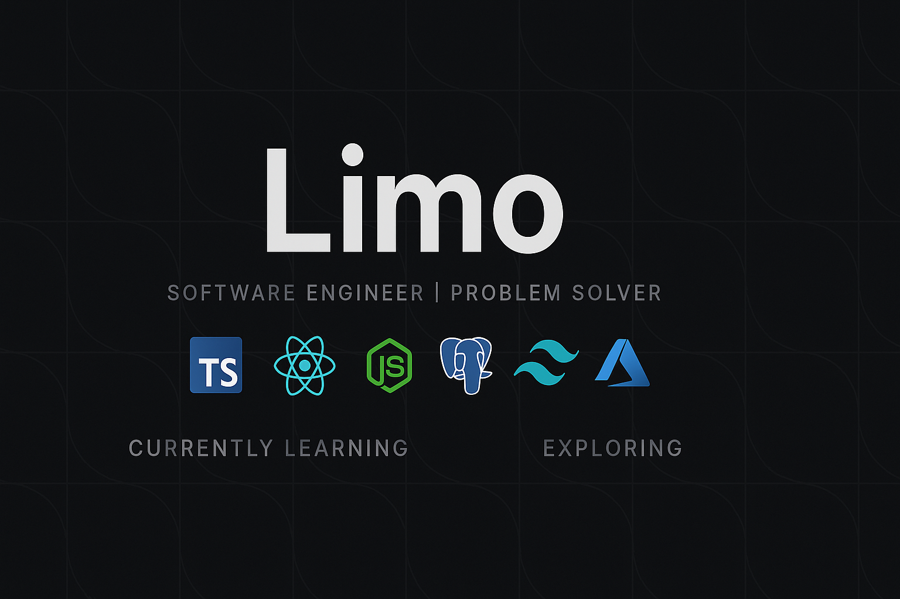

<!-- Banner with adjusted height -->

# 👋 Hi, I’m Boaz Limo

  

💡 I'm a passionate **Software Engineer** focused on building modern, scalable, and reliable systems using clean architecture, test-driven development, and powerful tooling.

---

## 📊 GitHub Stats

---

## 🔍 Currently Exploring

- 🧠 Improving TypeScript architecture and DDD practices
- 🚀 Java and systems-level development
- ☁️ Azure Functions & serverless event-driven architecture
- ⚡ Full-stack productivity + Express.js + Drizzle ORM

---

## 📌 Tech Stack Overview

  

---

<!-- ## 📈 Contribution Activity -->

<!--  -->

---

## 🛠️ Languages & Tools

---

## 🚀 Featured Projects

### 📚 Bookstore UI

> A modular and scalable frontend built with **React + TypeScript**.  
> Features include: user auth, dynamic listings, and form-driven UX.

🔗 [View on GitHub](https://github.com/LimoB/bookstore-ui)

---

### 🍽️ Restaurant Frontend

> A dynamic food ordering platform using **React + Tailwind CSS**.  
> Admin dashboard, charts, menu filtering, and user authentication included.

🔗 [View on GitHub](https://github.com/LimoB/restaurant-frontend)

---

## 📰 Blog Posts

🛠️ _Coming soon: deep dives into design patterns, deployment, and real-world debugging tips!_

---

## 🌐 Connect with Me

  

---

## 📫 Contact Me

📍 **Location:** Nairobi, Kenya  
📧 **Email:** boazlimo07@gmail.com
